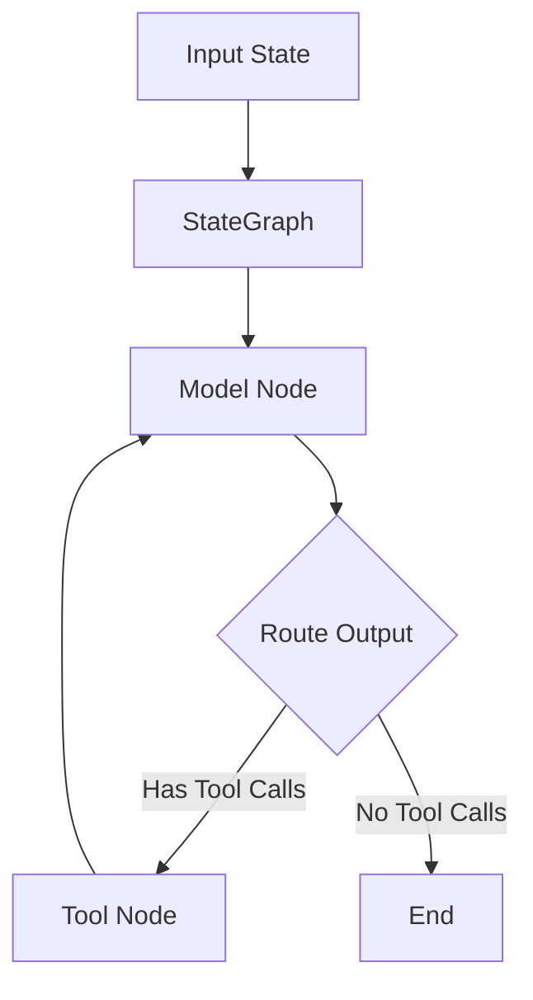

# Drawi Agent Technical Documentation

## Overview
Drawi Agent is a custom Reasoning and Action (ReAct) agent built using LangGraph and LangChain. It's designed to interact with social media platforms and perform web searches while maintaining a structured conversation flow.

## Architecture

### Core Components



The agent uses a cyclic graph architecture where:
1. Input is processed through a state graph
2. The model makes decisions about tool usage
3. Tools are executed as needed
4. Results are fed back to the model for further processing

## Tech Stack

### Core Technologies
- **Python** (>=3.9)
- **LangGraph** (>=0.2.6): Manages the agent's workflow and state
- **LangChain** (>=0.2.14): Provides the foundation for LLM interactions
- **OpenAI GPT-4**: Default language model for agent interactions

### Key Dependencies
- `langchain-openai`: OpenAI model integrations
- `langchain-anthropic`: Anthropic model support
- `langchain-fireworks`: Alternative model provider support
- `python-dotenv`: Environment variable management
- `tavily-python`: Web search capabilities
- `tweepy`: Twitter API interactions
- `twikit`: Additional Twitter functionality

## Components Breakdown

### 1. Configuration System
```python
@dataclass(kw_only=True)
class Configuration:
    system_prompt: str
    model: str = "openai/gpt-4"
    max_search_results: int = 10
    max_tweets_to_process: int = 20
    min_engagement_rate: float = 0.01
    # ... additional configuration fields
```

### 2. State Management
The agent maintains state through:
- Input state tracking
- Message history
- Tool execution results
- Configuration parameters

### 3. Tools
Available tools include:
- Web search (via Tavily)
- Twitter interactions:
  - Mention monitoring
  - Tweet searching
  - Reply functionality
  - User information retrieval
  - Tweet posting

### 4. Graph Structure
The agent uses a StateGraph with:
- Model node for LLM interactions
- Tool node for executing actions
- Conditional routing based on model output
- Cyclic processing for continuous operation

## API Integration

### Twitter API Integration
```python
class TwitterIntegration:
    - Authentication methods: OAuth 1.0a and Bearer Token
    - Endpoints utilized:
        - User mentions
        - Tweet creation
        - User information
        - Search functionality
```

### Search Integration
```python
class SearchIntegration:
    - Provider: Tavily
    - Features:
        - Web search
        - Result filtering
        - Customizable result count
```

## Configuration Schema

### Environment Variables
Required variables:
```
X_API_KEY=<twitter_api_key>
X_API_SECRET=<twitter_api_secret>
X_ACCESS_TOKEN=<twitter_access_token>
X_ACCESS_TOKEN_SECRET=<twitter_access_token_secret>
X_BEARER_TOKEN=<twitter_bearer_token>
X_USER_ID=<twitter_user_id>
TWIKIT_USERNAME=<twikit_username>
TWIKIT_EMAIL=<twikit_email>
TWIKIT_PASSWORD=<twikit_password>
```

### Runtime Configuration
The agent supports dynamic configuration through RunnableConfig, allowing for:
- Model selection
- Search result limits
- Tweet processing limits
- Engagement rate thresholds
- Crypto keyword customization

## Error Handling

The agent implements comprehensive error handling for:
- API rate limits
- Authentication failures
- Network issues
- Invalid tool calls
- State management errors

## Development Tools

### Testing
- Unit tests
- Integration tests
- VCR.py for API mocking
- Pytest framework

### Code Quality
- Ruff for linting
- MyPy for type checking
- Google-style docstrings
- Automated formatting

## Performance Considerations

### Rate Limiting
- Twitter API constraints
- Search API quotas
- Model token limits

### State Management
- Message history optimization
- Tool result caching
- Configuration persistence

## Security

### Authentication
- OAuth 1.0a for Twitter posting
- Bearer token for Twitter reading
- Environment variable isolation
- Credential management

### Data Protection
- No persistent storage of sensitive data
- Secure configuration handling
- Environment separation

## Future Considerations

### Scalability
- Multiple model support
- Additional social platforms
- Enhanced tool capabilities
- Parallel tool execution

### Monitoring
- Error tracking
- Performance metrics
- Usage statistics
- API quota management
